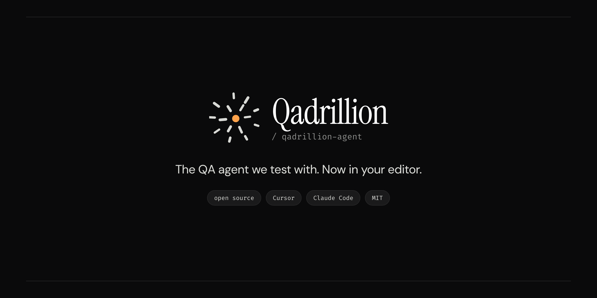

<p align="center">
  
</p>

<p align="center">
  <a href="LICENSE"></a>
  <a href="https://github.com/Qadrillion/qadrillion-agent/actions/workflows/governance.yml"></a>
</p>

# qadrillion-agent

An open-source QA agent for agentic software testing in Cursor and Claude Code. Clone it, open it, type a ticket ID. The agent reads the ticket, reviews the product source for testable risk, writes tests against identifiers that exist in the build, runs them, and prepares the tracker comment — and stops, deterministically, at the things a QA engineer must decide: anything aimed at production, any write to an external system, any locator the app does not ship.

Built for testers, not against them. Every output is an artifact a QA lead reads and signs.

[Qadrillion](https://qadrillion.com/repo) publishes this agent and tests with it. Free, MIT, no account, no telemetry.

## Five minutes

```bash
git clone https://github.com/Qadrillion/qadrillion-agent.git qa-workspace
cd qa-workspace
chmod +x .cursor/hooks/*.sh .cursor/hooks/tests/run-tests.sh .claude/hooks/*.sh tools/workspace/*.sh
./.cursor/hooks/tests/run-tests.sh          # expect: passed: 71  failed: 0
```

Open the folder in Cursor, start an Agent chat, type `PROJ-123` (or `/qa PROJ-123`). That is the interface. Claude Code users: `claude` in the same folder reads `CLAUDE.md` → `AGENTS.md` and runs the same fences.

Or choose **Use this template** on GitHub and start from your own copy.

Then make it yours (ten minutes, all in three files):

| File | What to change |
|---|---|
| `workspace-manifest.json` | your automation repo and product checkouts, with what the agent may mutate in each |
| `.cursor/hooks/guard.conf` | your production hosts, your protected paths, the MCP servers you deny |
| `.cursor/mcp.json` (gitignored) | your tracker, wiki, and design servers. Create this file locally. Never commit it. |

## What is in the box

| Layer | Path | Job |
|---|---|---|
| **Boundaries** | `.cursor/hooks/` | Three fail-closed guards (shell, MCP, file read) + `guard.conf`. Deny destructive git, credential reads, production-targeted runs, protected paths, denied servers; **ask** before every external write. 71 golden payloads; run them after any edit. |
| **Identity** | `AGENTS.md` | ~500 words: who the agent is, cold-start order, classification, budgets, evidence contract. No rules live here — a rule in prose is a request. |
| **Style** | `.cursor/rules/core.mdc` | The only always-on rule, under 120 words (CI enforces it). |
| **Contracts** | `.cursor/rules/*.mdc` | One contract per rule, loaded only when relevant: ticket schema + state machine, source-review `[SEVERITY]` output, test hard rules, tracker comment format. Skills and subagents reference them, never copy them. |
| **Procedures** | `.cursor/skills/` | `/qa` (the front door), `qa-workflow` (the loop it sequences), `/golden-tasks` (regression for the agent layer itself). |
| **Workers** | `.cursor/agents/` | `code-explorer`, `code-reviewer` (read-only), `test-runner`, `ticket-writer`, `tracker-reporter`. |
| **Memory** | `docs/STATE.md` · `docs/decisions/` · `docs/sessions/` · `tickets/` | Live state is one overwritten file; decisions have records; history is appended and never read cold; every ticket has a durable file whose frontmatter is the resume payload. |
| **Claude Code** | `CLAUDE.md` · `.claude/` | One adapter feeding the same three guards. One fence, two harnesses. |
| **CI** | `.github/workflows/governance.yml` | Hook payloads, adapter mapping, ticket schema, index freshness, the always-on budget. The setup tests its own setup. |

## The five things this gets right that most setups do not

1. **Boundaries are hooks, not sentences.** "Never run against prod" is a regex in `guard.conf`, evaluated outside the model on every command. Cloud agents see the same file.
2. **No Pass without execution evidence.** From code inspection you get a risk list, not a verdict.
3. **Locators are source-grounded, with two proofs.** In source (offline audit) and in the installed build (live smoke). A miss is quarantined, never guessed — the fix is a product PR.
4. **A failure is a finding.** Re-run once, then report both outputs. No auto-rerun plugin, ever.
5. **State is overwritten; history is appended.** `docs/STATE.md` is ≤60 lines and read once at cold start, not injected into every turn.

## Acceptance test, once per machine

Ask the agent to run a hard `git reset` in a scratch repo. A live fence returns the hook's own message in the Hooks output channel. Do not test with force-push — the model refuses that on its own and the refusal masquerades as a working fence. A hook you have not seen execute is not a hook.

## Adapting to your stack

[`docs/adopting.md`](docs/adopting.md) is the checklist: what to fill in, what to measure before and after (Cursor's Context Usage panel), and the patterns a real team workspace built on this skeleton should end up with. [`tickets/PROJ-101.md`](tickets/PROJ-101.md) is a worked example ticket against a fictional product. The reasons for the fences are in [`docs/decisions/INDEX.md`](docs/decisions/INDEX.md).

## What this is not

Not a test runner, not a test platform, not a tracker. Tests live and run where yours already do. It never edits product code on its own; a product change is a ticket-scoped PR a human reviews. The engineer signs the artifact.

## License

MIT — see [`LICENSE`](LICENSE). No telemetry, no account, no network calls of its own.
